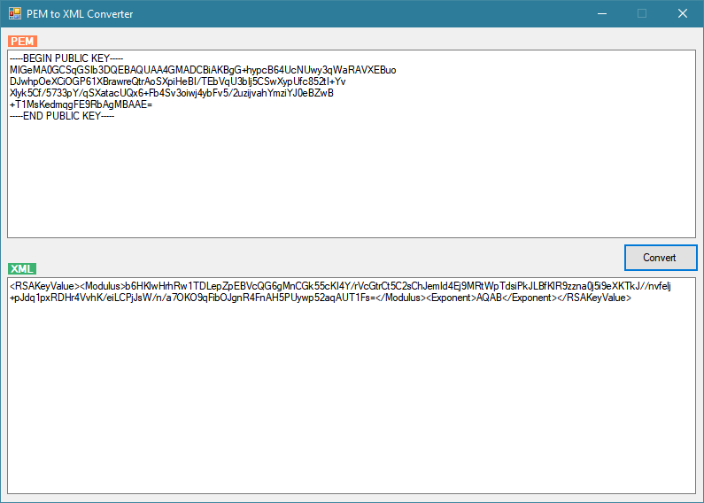

# PEM to XML Converter for .NET Framework
 
This project provides a .NET Framework library for converting PEM-formatted keys into XML format, suitable for use with the `RSACryptoServiceProvider` class. It supports various PEM formats, including RSA private and public keys, PKCS#8 private keys (both encrypted and unencrypted).

## Features

- Supports RSA private and public key formats.
- Supports PKCS#8 private key formats, both encrypted and unencrypted.
- Verbose debugging support for detailed logging.
- Secure password handling for encrypted keys.

## Getting Started

### Prerequisites

- .NET Framework 4.5 or higher.

